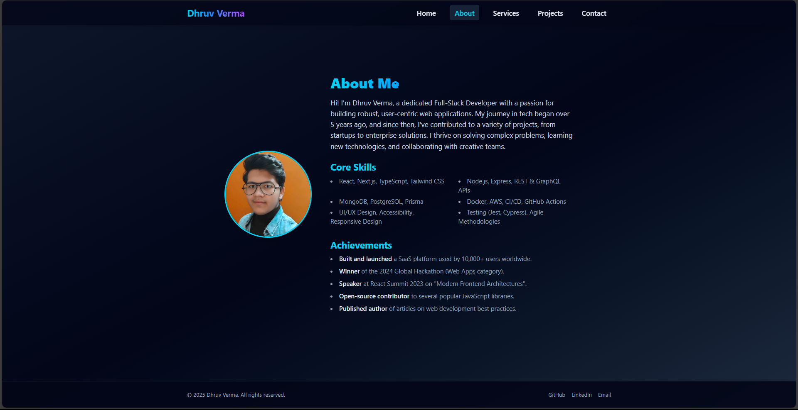

# Dhruv Verma – Full-Stack Developer Portfolio

Welcome to my portfolio! This project showcases my work, skills, and experience as a full-stack developer, built with React, TypeScript, Vite, and Tailwind CSS.

## 🚀 Features
- Modern, responsive design
- Animated hero and section transitions
- Project showcases with details and tech stack
- About, Services, and Contact pages
- Accessible, mobile-friendly navigation
- Contact form and social links

## 🛠️ Tech Stack
- **Frontend:** React, TypeScript, Tailwind CSS
- **Backend:** Node.js, Express, MongoDB, PostgreSQL (for real projects)
- **DevOps:** Docker, GitHub Actions, Vercel/Netlify

## 📂 Project Structure
```
src/
  components/      # Reusable UI components (Navbar, Footer, etc.)
  layout/          # Main layout wrapper
  pages/           # Main pages (Home, About, Projects, Services, Contact, NotFound)
  assets/          # Images and static assets
```

## 📸 Screenshots


## 📦 Getting Started
1. **Install dependencies:**
   ```sh
   npm install
   ```
2. **Run the development server:**
   ```sh
   npm run dev
   ```
3. **Open in your browser:**
   Visit [http://localhost:5173](http://localhost:5173)

## ✨ Customization
- Update your name, bio, and project data in the relevant files in `src/pages/` and `src/components/`.
- Replace images in `public/` or `src/assets/`.
- Adjust theme and styles via Tailwind classes.

## 📬 Contact
- **Email:** dhruvverma.dev@gmail.com
- **GitHub:** [github.com/dhruvverma2002](https://github.com/dhruvverma2002)
- **LinkedIn:** [linkedin.com/in/dhruv-verma-31330730b/](https://linkedin.com/in/dhruv-verma-31330730b/)

---

© {2025} Dhruv Verma. All rights reserved.
